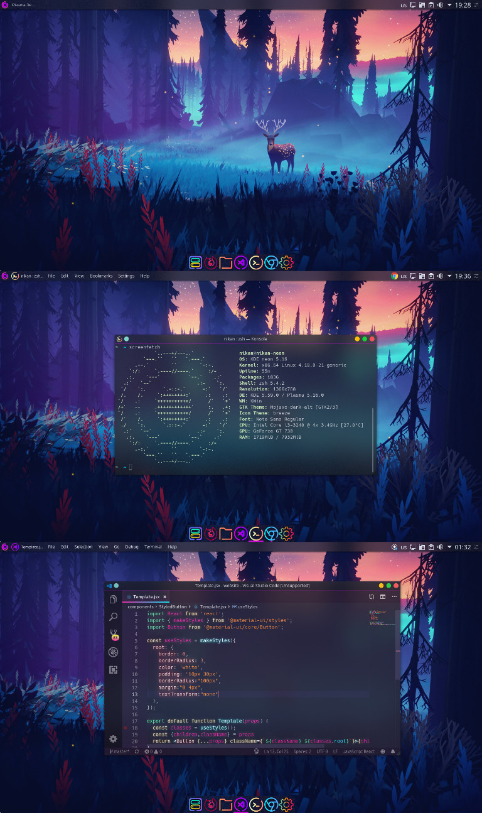

# My desktop



Recently i shared my desktop to a subreddit and alot of people loved this blurry vscode!

You can find the post <a href="https://www.reddit.com/r/unixporn/comments/c0hlt8/kwinkde_neon_my_blurry_setup/">Here!</a>

I always wanted to blur my vscode, its fancy and looks great.

but could not find a way to do it on linux and gnome based desktops

# Tested desktops

* KDE Neon
* KDE Plasma
* Ubuntu 18.04

This should work on other gnome based desktops as well

# <a href="https://wiki.gnome.org/action/show/Projects/DevilsPie?action=show&redirect=DevilsPie">DevilsPie comes to the rescue</a>

DevilsPie is a great software that run a set of scripts when a window is launched.

So this means we can run something when vscode runs and thats the magic of it!

## Install it!

`sudo apt install devilspie`

## Make the script directory

`mkdir ~/.devilspie`

## Create the script

`nano ~/.devilspie/vscode.ds`

### paste in this code

### KDE with blur

```
(if (contains (window_class) "Code")
    (begin
        (spawn_async (str "xprop -id " (window_xid) " -f _KDE_NET_WM_BLUR_BEHIND_REGION 32c -set _KDE_NET_WM_BLUR_BEHIND_REGION 0 "))
        (spawn_async (str "xprop -id " (window_xid) " -f _NET_WM_WINDOW_OPACITY 32c -set _NET_WM_WINDOW_OPACITY 0xdfffffff"))
    )
)
```

### Ubuntu without blur
```
( if
( contains ( window_class ) "Code" )
( begin
( spawn_async (str "xprop -id " (window_xid) " -f _NET_WM_WINDOW_OPACITY 32c -set _NET_WM_WINDOW_OPACITY $(printf 0x%x $((0xffffffff * 87 / 100)))") )
)
)
```

`ctrl+o` to write the file

and

`ctrl+x` to exit nano

## Test it

open a terminal and write

`devilspie`

and try to open vscode!

then close the vscode and stop devilspie with `ctrl + c`

## Enable it!

Go ahead and enable it so you dont have to run devilspie manually everytime!

`nano ~/.config/autostart/devile.desktop`

### paste in this code

```
[Desktop Entry]
Name="devilspie"
GenericName="devilspie"
Comment="Run devilspie at startup"
Exec=/usr/bin/devilspie
Terminal=false
Type=Application
X-Gnome-Autostart=true
```

`ctrl+o` to write the file

and

`ctrl+x` to exit nano

Go to System Settings > Startup and Shutdown > Autostart

and make sure devilspie is enabled.

and finally reboot, and thats it!

Now enjoy the blur

# Bonus

you can install `SynthWave '84` theme  for a better look!


credits for the script goes to <a href="https://dev.to/emmanuelnk/how-to-be-cool-and-make-vscode-transparent-56ib">
Emmanuel N Kyeyune</a>